# Alumni Tracking System - Complete Documentation
## Overview
This is a system that aims to track and provide a way to query to get the alumni in ECU.
The main functions of the system are:
1. Data collection either manually or via web research
2. Storage and Viewing the records of the alumnis in ECU
3. Analysis of results using AI

## The Program
- The program is divided into the frontend (for the UI and the basic interaction with the user) and the backend (for the logic)
- Below is a brief overview of how the program looks like:
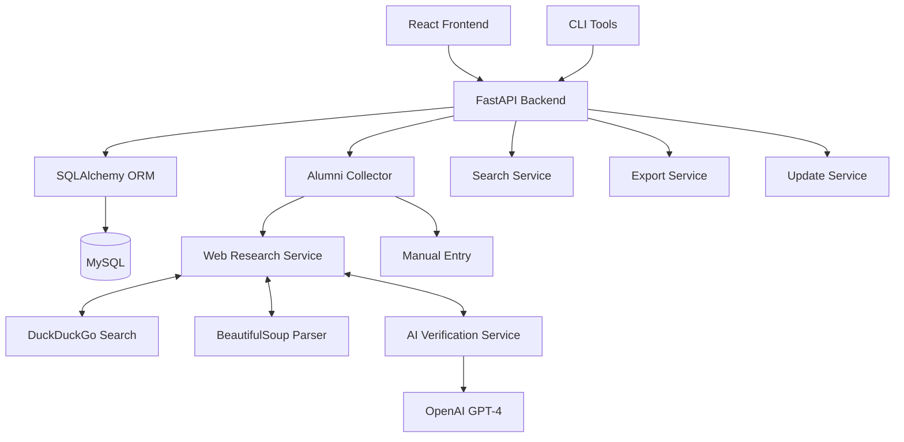
### The frontend
- The frontend was built with **React Js** and **materials UI library**. We used **axios** to reach the backend.
```
frontend/
├── public/
│   ├── img/
│   │   └── Edith_Cowan_University_Logo.svg
│   └── index.html
├── src/
│   ├── components/
│   │   └── Layout.js          # Main layout with sidebar and navigation
│   ├── pages/
│   │   ├── Login.js           # Authentication page for user login
│   │   ├── Alumni.js          # Alumni directory with view/edit/delete
│   │   ├── Analytics.js       # AI-powered query interface
│   │   ├── Dashboard.js       # Overview dashboard
│   │   └── DataCollection.js  # Manual and web research data entry
│   ├── utils/
│   │   └── api.js             # API configuration and utilities
│   ├── App.js                 # Main app component with routing
│   └── index.js               # React entry point
├── package.json               # Dependencies and scripts
└── .env                       # Environment variables
```
#### **App.js** 
- This is the main entry point of the app.
- Retrieves the information of the previous authenticated user from the local storage and verifies its authenticity with the backend
 - Handles login and logouts
 - coordinates the rendering of the page
 - 
#### Components folder
- This contains the reusable components such as:
  **Layout.js**: Used to show the default layout with sidebar navigation and header, displayed to authenticated users.
#### **Pages folder** 
- Contains the main page components that represent different views or screens in the application.
- Each page is a full-screen component that handles specific functionality and user interactions.
- The pages include:
  - **Login.js**: Authentication page where users enter their credentials to access the system.
  - **Dashboard.js**: Overview page showing system statistics, recent activities, and quick access to main features.
  - **Alumni.js**: Alumni directory page that fetches and displays alumni records from the backend, with options to view, edit, or delete profiles.
  - **Analytics.js**: AI-powered analytics page allowing users to query alumni data using natural language and view results.
  - **DataCollection.js**: Data collection page for manual entry of alumni information or initiating automated web research collection.

#### Utils folder
- Contains utility functions and configurations shared across the application.
- The main file is:
  - **api.js**: Centralizes API endpoint URLs and configurations, using environment variables for base URLs to support different environments (development, production).


### Backend
- The backend is built with **FastAPI** and **SQLAlchemy**, providing RESTful APIs for data management and processing. We also used external services and APIs like **DuckDuckGo**, **BeautifulSoup**, and LLMs like **OpenAI GPT-4o-mini**
```
backend/
├── Dockerfile                    # Containerization for deployment
├── main.py                       # Application launcher (runs uvicorn)
├── requirements.txt              # Python dependencies
├── src/
│   ├── api/                      # FastAPI routers and endpoints
│   │   ├── main.py               # Main API app and router registration
│   │   ├── alumni.py             # Alumni CRUD operations
│   │   ├── auth.py               # Authentication endpoints
│   │   ├── collection.py         # Data collection management
│   │   ├── export.py             # Data export functionality
│   │   ├── health.py             # Health check endpoint
│   │   ├── query.py              # AI-powered query processing
│   │   ├── stats.py              # Statistics and analytics
│   │   ├── upload.py             # File upload handling
│   │   └── utils.py              # API helper functions
│   ├── config/
│   │   └── settings.py           # Application configuration
│   ├── database/
│   │   ├── connection.py         # Database connection setup
│   │   ├── init_db.py            # Database initialization
│   │   ├── models.py             # SQLAlchemy models
│   │   └── repository.py         # Data access layer
│   ├── models/
│   │   ├── alumni.py             # Alumni data models
│   │   └── user.py               # User data models
│   └── services/
│       ├── ai_query_service.py   # AI query processing
│       ├── ai_verification.py    # AI-powered verification
│       ├── alumni_collector.py   # Alumni data collection
│       ├── export_service.py     # Data export logic
│       ├── search_service.py     # Search functionality
│       ├── update_service.py     # Data update operations
│       └── web_research_service.py # Web research capabilities
└── tests/                        # Unit and integration tests
```

#### API folder
- Contains FastAPI router modules that define the REST API endpoints organized by functionality.
- **main.py**: Central FastAPI application setup with CORS middleware, authentication utilities, and legacy endpoint implementations. Includes modular router registration and serves as the main API entry point with comprehensive endpoint coverage.
- **alumni.py**: Alumni CRUD operations router providing endpoints for retrieving, viewing, and deleting individual alumni profiles, with proper error handling and data formatting.
- **auth.py**: Authentication router handling JWT token-based login, user verification, and current user information retrieval using secure password validation.
- **collection.py**: Background data collection router managing asynchronous alumni data gathering tasks with progress tracking, supporting web research collection methods.
- **export.py**: Data export and dashboard router providing Excel/CSV export functionality with filtering options, recent alumni listings, and dashboard statistics endpoints.
- **health.py**: System health monitoring router with database connectivity checks and alumni count reporting for operational status assessment.
- **query.py**: AI-powered query router handling natural language processing for alumni data queries using OpenAI GPT-4o-mini and web research capabilities for enhanced data discovery.
- **stats.py**: Statistics and analytics router providing distribution analysis for industries, companies, locations, and comprehensive alumni statistics for data insights.
- **upload.py**: File upload router for bulk alumni name processing from Excel/CSV files with optional automatic data collection integration.
- **utils.py**: API utility functions including standardized alumni data formatting for consistent JSON responses across all endpoints.

| File | Endpoint | Method | Description |
|------|----------|--------|-------------|
| **main.py** | `/` | GET | Welcome message and API information |
| | `/alumni/{id}` | PUT | Update an existing alumni profile |
| | `/search` | GET | Search alumni with advanced filters and pagination |
| | `/manual-collect` | POST | Manually add alumni profile data |
| | `/update` | POST | Update existing alumni profiles with fresh data |
| **alumni.py** | `/alumni` | GET | Retrieve all alumni profiles with optional filtering |
| | `/alumni/{id}` | GET | Get specific alumni profile by ID |
| | `/alumni/{id}` | DELETE | Delete an alumni profile by ID |
| **auth.py** | `/auth/login` | POST | User authentication with JWT token generation |
| | `/auth/me` | GET | Get current authenticated user information |
| **collection.py** | `/collect` | POST | Start background data collection task |
| | `/collect/status/{task_id}` | GET | Check status of data collection task |
| **export.py** | `/dashboard/stats` | GET | Get dashboard statistics and overview data |
| | `/dashboard/export` | GET | Export dashboard data in various formats |
| | `/dashboard/recent` | GET | Get recently added or updated alumni profiles |
| | `/dashboard/collect` | POST | Trigger data collection from dashboard |
| | `/dashboard/graduation-years` | GET | Get distribution of alumni by graduation year |
| | `/dashboard/confidence-scores` | GET | Get distribution of alumni confidence scores in ranges |
| | `/export` | GET | Export alumni data to Excel/CSV with filters |
| | `/recent` | GET | Get recently added alumni profiles |
| **health.py** | `/health` | GET | System health check and database connectivity status |
| **query.py** | `/query` | POST | Process natural language queries using AI |
| | `/web-research` | POST | Perform web research for alumni information |
| **stats.py** | `/stats` | GET | Get comprehensive alumni statistics and analytics |
| | `/industries` | GET | Get distribution of alumni across different industries |
| | `/companies` | GET | Get list of top companies where alumni work |
| | `/locations` | GET | Get geographical distribution of alumni |
| **upload.py** | `/upload-names` | POST | Upload Excel/CSV files with alumni names for processing |

#### Config folder
- Holds application configuration settings, such as database URLs, API keys, and environment variables.

#### Task Collection System
- Manages asynchronous background tasks for alumni data collection, providing progress tracking and persistence across application restarts.
- **Task Management**: Uses database-backed task storage with unique UUID identifiers, status tracking, and result persistence. Supports both web research and manual collection methods with comprehensive error handling and progress reporting.

**Task Database Model (TaskDB)**:
- `id`: UUID primary key for unique task identification
- `status`: Current task state (running/completed/failed)
- `names`: JSON array of input names to process
- `method`: Collection method (web-research/manual)
- `start_time`: Task initiation timestamp
- `end_time`: Task completion timestamp
- `results_count`: Number of successful profiles collected
- `results`: JSON array of formatted alumni profiles
- `failed_names`: JSON array of names that failed collection with reasons
- `error`: General error message if task failed


#### Database folder
- Manages database connections, schema definitions, and data access operations using SQLAlchemy ORM with MySQL.
- **connection.py**: Manages database connections and sessions using SQLAlchemy. Sets up a MySQL database connection with SSL encryption, creates all database tables, and automatically adds default users (admin and faculty) if the database is empty. Provides session management utilities for database operations.
- **init_db.py**: A standalone database initialization script that creates all database tables and adds initial user data. Can be run independently to set up the database schema and populate it with default admin and faculty users. Includes proper logging for initialization status.
- **models.py**: Defines the SQLAlchemy database models (tables) using declarative base. Contains five main models: UserDB (user accounts with roles), AlumniProfileDB (main alumni profile data), WorkHistoryDB (employment history), EducationDB (education history), DataSourceDB (data collection sources and metadata), and TaskDB (background collection tasks).
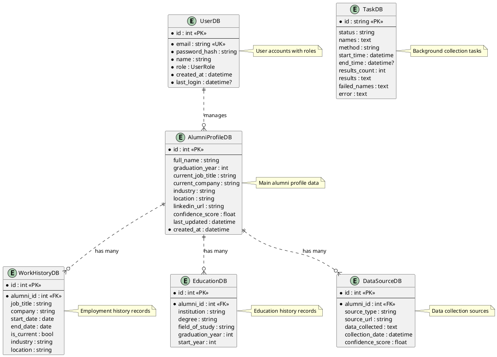
- **repository.py**: Contains the AlumniRepository class that serves as the data access layer. Provides comprehensive CRUD operations for alumni profiles including create, read, update, delete, and advanced search functionality with multiple filter criteria. Handles work history, education history, and data source management, with robust conversion between database models and application domain models. Includes data validation, pagination support, and proper error handling.
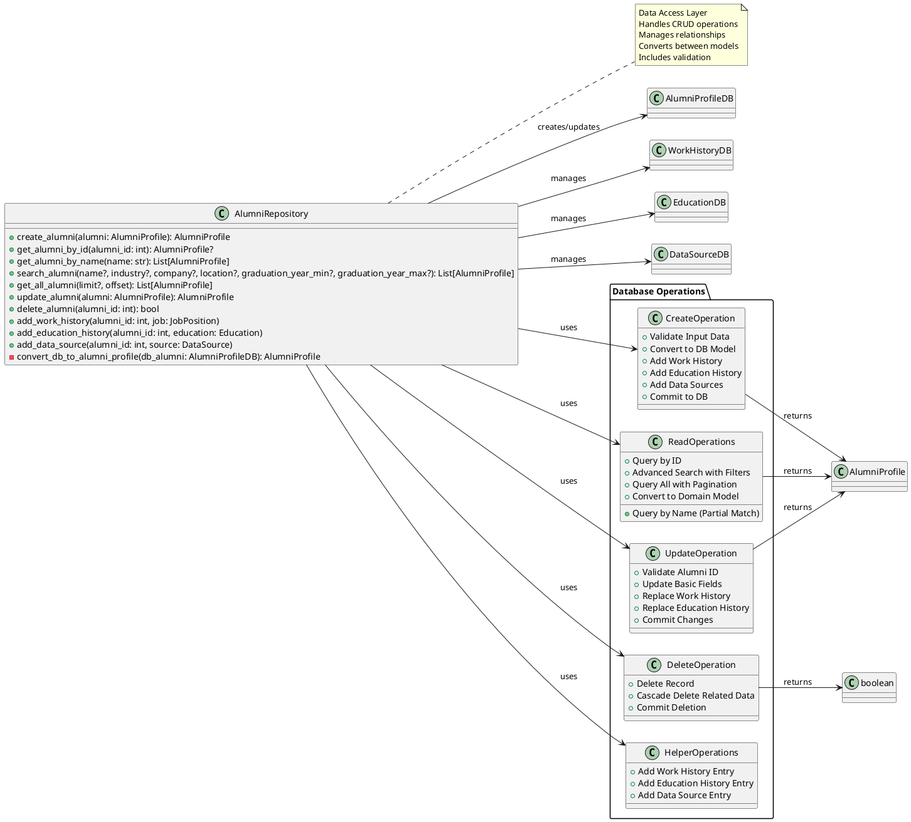

#### Models folder
- Defines Pydantic-style data models for application domain objects with validation and type safety.
- **alumni.py**: Contains core alumni data models including IndustryType enum, JobPosition dataclass for employment records, DataSource dataclass for tracking data collection origins, and AlumniProfile dataclass as the main alumni data structure with comprehensive validation and business logic methods.
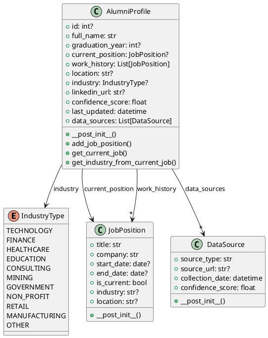
- **user.py**: Contains the User model extending UserDB with password hashing/verification using bcrypt, and utility methods for API serialization and authentication.
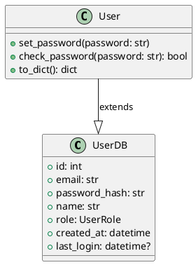

#### Services folder
- Contains business logic services for data collection, AI processing, export, and external API integrations.
- Includes services for web research and AI verification.

##### **ai_query_service.py**
- Handles AI-powered natural language queries, converting user questions into structured database queries using OpenAI GPT-4o-mini for intelligent alumni data analysis and filtering.
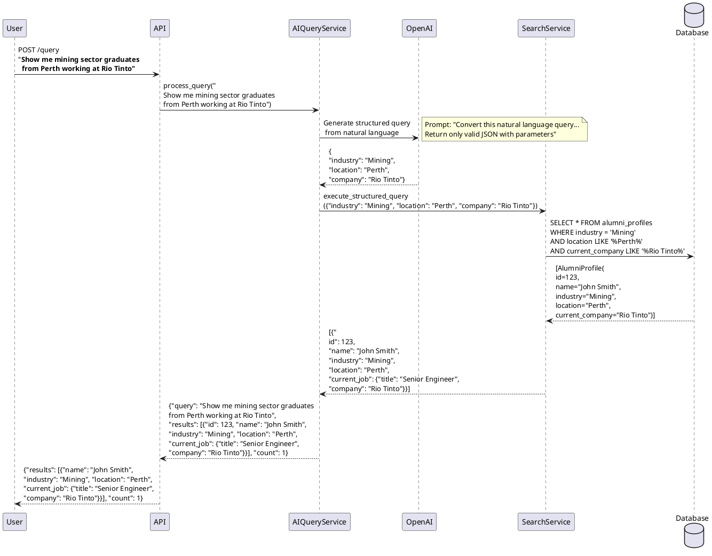

##### **ai_verification.py**
- Performs AI-powered verification of alumni profiles using OpenAI GPT-4o-mini, with comprehensive industry normalization and confidence scoring for data quality assurance.
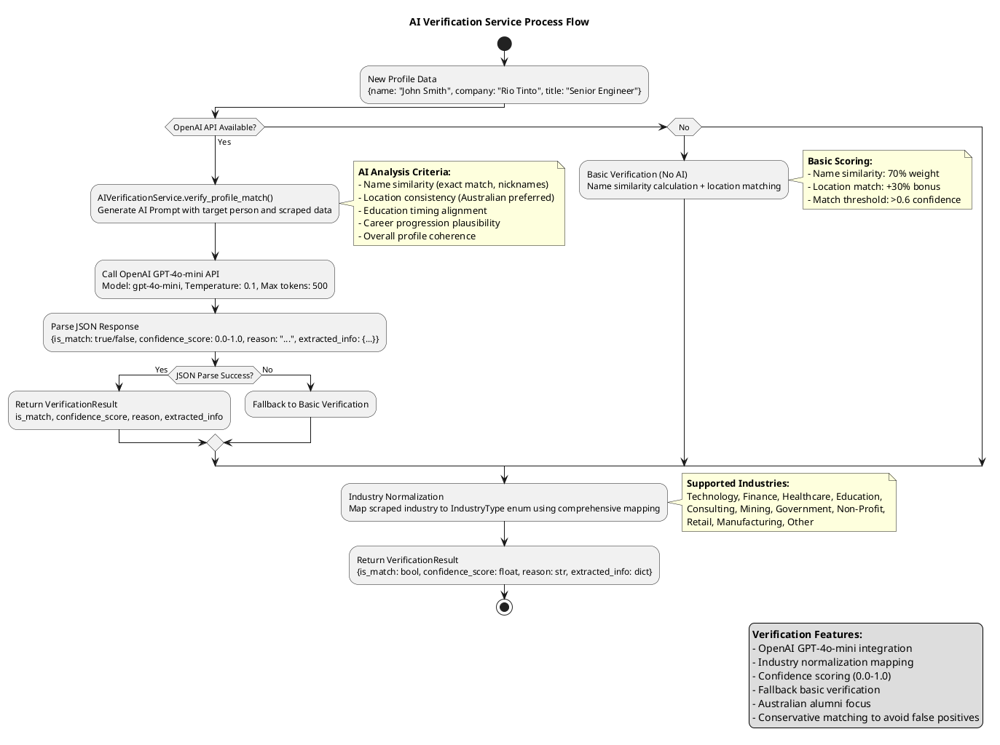

**Key Methods:**
- `verify_profile_match()`: Main verification method using AI analysis
- `normalize_industry()`: Maps industry strings to standardized IndustryType enum values
- `convert_web_data_to_profile()`: Converts unstructured web research into structured AlumniProfile objects
- `enhance_profile_data()`: Uses AI to clean and enhance scraped profile data
- `basic_verification()`: Fallback verification without AI using name/location matching

**Industry Mapping Examples:**
- "Information Technology" → "Technology"
- "Financial Services" → "Finance" 
- "Mining & Resources" → "Mining"
- "Government Administration" → "Government"
- Unknown industries → "Other"

##### **alumni_collector.py**
- Orchestrates data collection methods, coordinating between manual entry and web research to gather comprehensive alumni information.
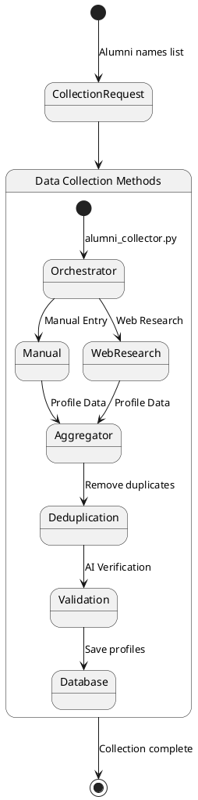

##### **export_service.py**
- Handles exporting alumni data to Excel and CSV formats, including work history, summary statistics, and filtered exports with customizable formatting options.
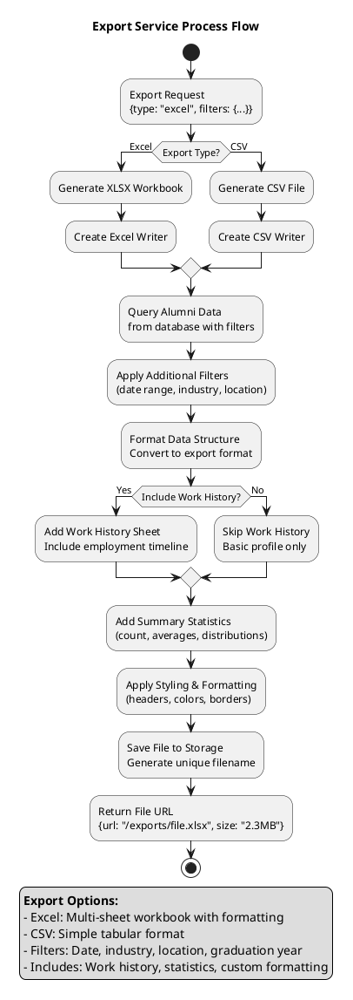

##### **search_service.py**
- Provides optimized search functionality for alumni data, including filtering, statistics, and distribution analysis across industries, locations, and companies.
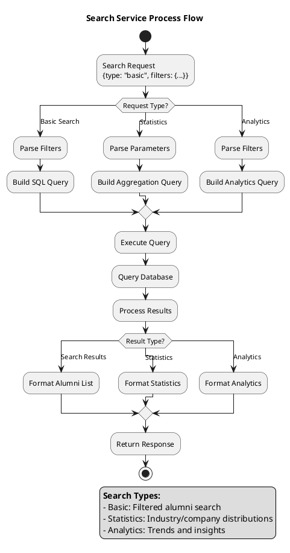

##### **update_service.py**
- Manages updating existing alumni profiles with fresh data from web research, including batch updates, scheduling, and statistics on profile freshness and data quality.
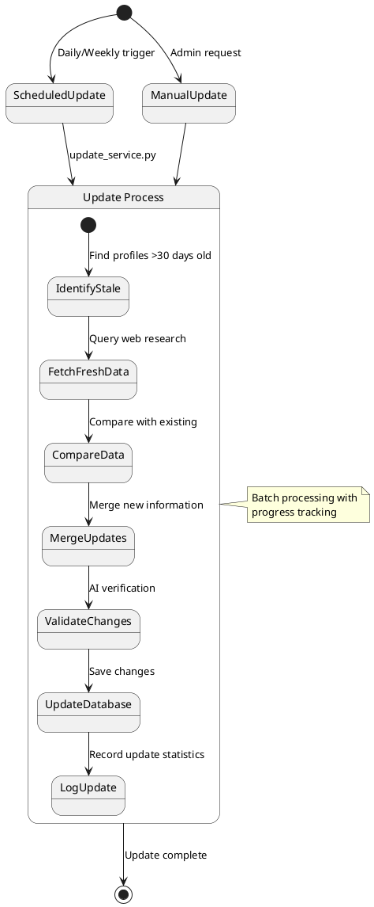

##### **web_research_service.py**
- Performs web research using DuckDuckGo search to find professional information about alumni, including LinkedIn profiles and ECU connections through HTML parsing.
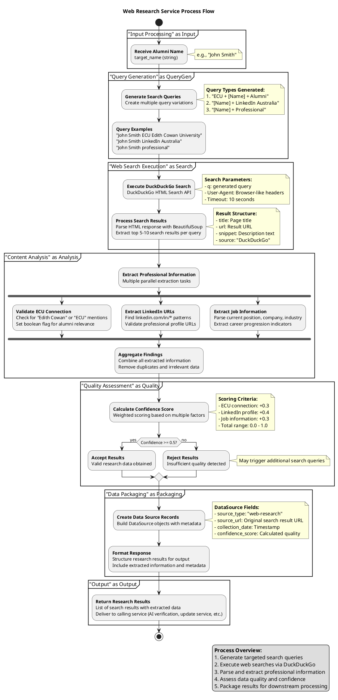

### Previous Data Collection Implementations (Not Used)

During the development process, we explored several external data collection services and APIs that were ultimately not implemented due to ethical, technical, or business constraints. Below, we document these implementations for reference:

#### BrightData Integration (Not Implemented - Ethical Concerns)
BrightData (formerly Luminati Networks) is a web scraping and data collection service that provides residential proxies and scraping infrastructure. We implemented a complete integration but ultimately decided not to use it due to ethical concerns around automated LinkedIn scraping.

##### **brightdata_parser.py** (Archived)
- Parses BrightData API responses, converting raw scraped data into structured AlumniProfile objects with proper data validation and formatting.
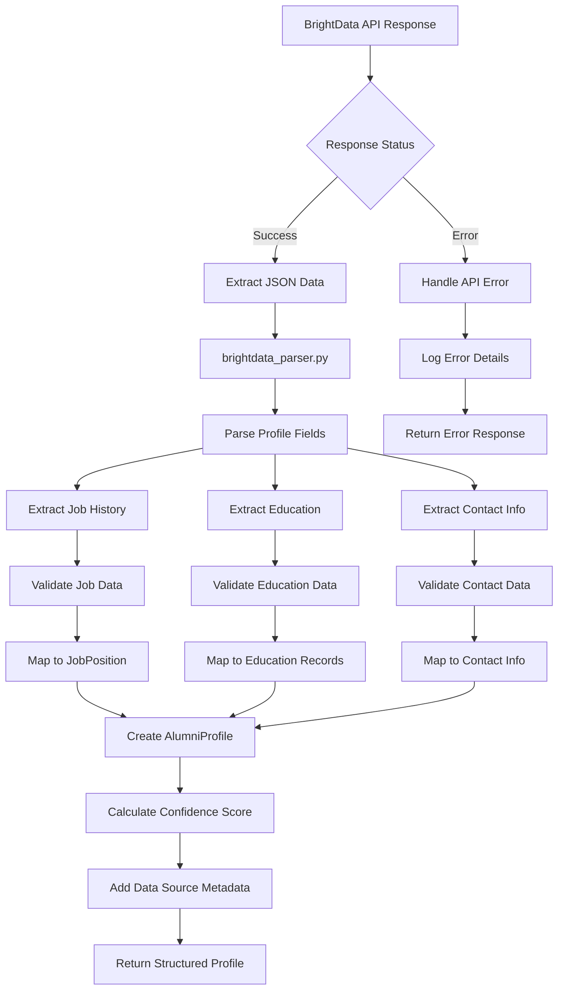

##### **brightdata_service.py** (Archived)
- Manages LinkedIn scraping via BrightData API, handling authentication, rate limiting, and data collection from LinkedIn profiles with anti-detection measures.
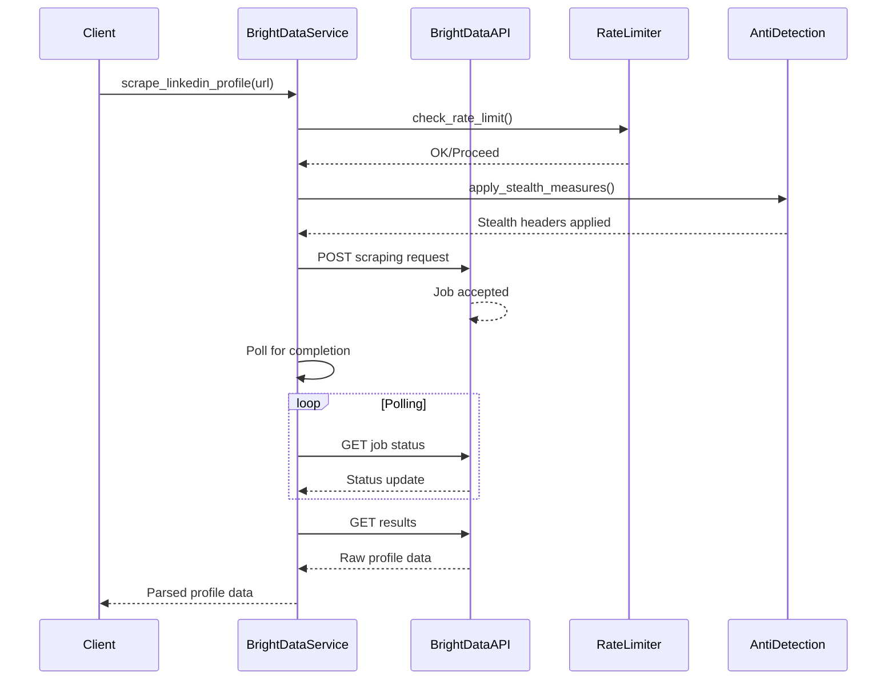

**Why BrightData Was Not Used:**
- **Ethical Concerns**: Automated scraping of LinkedIn profiles violates LinkedIn's Terms of Service and raises privacy concerns
- **Legal Risks**: Potential violations of data protection laws (GDPR, CCPA) and anti-scraping regulations
- **Platform Integrity**: Undermines LinkedIn's business model and user trust
- **Detection Risks**: LinkedIn actively blocks scraping attempts, making the solution unreliable

#### LinkedIn Official API Integration (Not Implemented - Limited Functionality)
LinkedIn provides official Partner APIs for developers, but these APIs have significant limitations for alumni data collection use cases.

##### **linkedin_official_api.py** (Archived)
- Integrates with LinkedIn's official Partner APIs for compliant data collection, including people search and profile details with rate limiting and industry mapping.
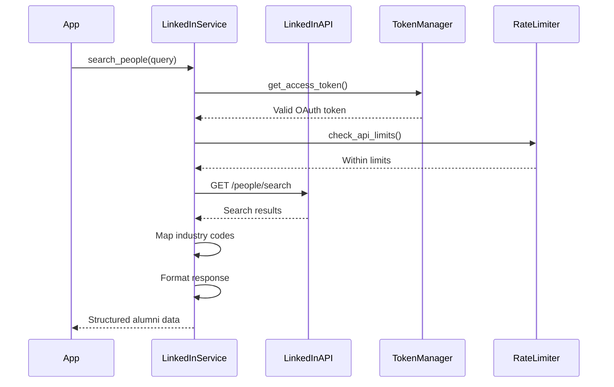

**Why LinkedIn Official API Was Not Used:**
- **Limited Data Access**: APIs only provide basic profile information (name, headline, location) - no detailed work history, education, or contact information
- **Partnership Requirements**: Requires formal partnership with LinkedIn and approval process
- **Use Case Restrictions**: APIs are designed for lead generation, job search, and profile management, not comprehensive alumni tracking
- **Cost and Complexity**: Expensive licensing fees and complex OAuth implementation
- **Rate Limiting**: Very restrictive API limits unsuitable for batch data collection

#### Updated System Architecture (Current Implementation)
After evaluating these external services, we implemented a solution using only ethical web research methods:

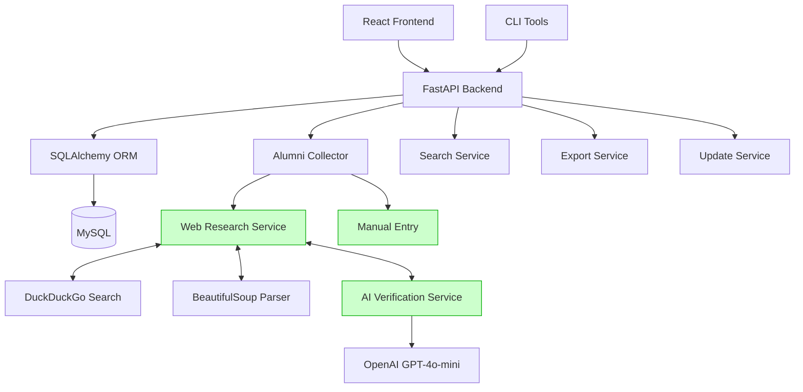

**Key Lessons Learned:**
1. **Ethics First**: Prioritize ethical data collection methods over comprehensive but questionable approaches
2. **API Limitations**: Official APIs often have significant restrictions that limit their usefulness
3. **Web Research Balance**: Public web research can provide valuable insights while respecting platform terms
4. **Transparency**: Documenting failed approaches helps future developers understand decision-making processes

## Technologies Used

### Frontend Technologies
- **React**: JavaScript library for building user interfaces
- **Material-UI (MUI)**: React component library for consistent UI design
- **Axios**: HTTP client for making API requests
- **React Scripts**: Build and development scripts for React applications

### Backend Technologies
- **FastAPI**: Modern, fast web framework for building APIs with Python
- **Uvicorn**: ASGI web server for running FastAPI applications
- **SQLAlchemy**: SQL toolkit and Object-Relational Mapping (ORM) for Python
- **Pydantic**: Data validation and settings management using Python type annotations
- **Pandas**: Data manipulation and analysis library
- **OpenPyXL**: Library for reading and writing Excel files
- **BeautifulSoup4**: HTML and XML parsing library
- **DuckDuckGo**: Search engine for web research
- **OpenAI GPT-4o-mini**: AI language model for query processing and verification
- **Requests**: HTTP library for Python
- **OpenAI**: Python client for OpenAI API
- **Celery**: Distributed task queue for asynchronous processing
- **Redis**: In-memory data structure store for caching and message brokering
- **Python-dotenv**: Loads environment variables from .env files
- **Python-multipart**: Streaming multipart parser for Python
- **Pytest**: Testing framework for Python
- **Pytest-asyncio**: Pytest plugin for testing async code

### Development and Deployment Tools
- **Docker**: Containerization platform for packaging applications
- **Git**: Version control system
- **Mermaid & PlantUML**: Text-based diagramming tools for creating flowcharts, sequence diagrams, class diagrams, and state diagrams
- **MySQL**: Primary database system (Aiven Cloud MySQL for both development and production)


## Deployment Architecture
We utilized **Render** for the deployment of the backend and **Vercel** for hosting the frontend. The database was hosted on **AWS** which is managed by **Aiven**

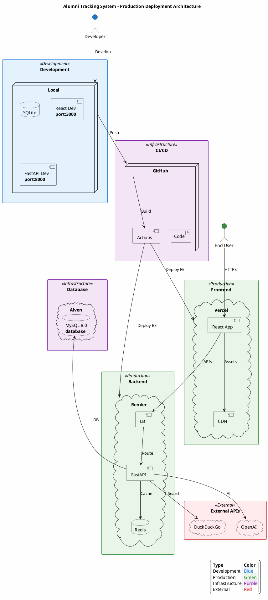
