# Alumni Tracking System - Complete Documentation
## Overview
This is a system that aims to track and provide a way to query to get the alumni in ECU.
The main functions of the system are:
1. Data collection either manually or via web research
2. Storage and Viewing the records of the alumnis in ECU
3. Analysis of results using AI

## The Program
- The program is divided into the frontend (for the UI and the basic interaction with the user) and the backend (for the logic)
- Below is a brief overview of how the program looks like:

### The frontend
- The frontend was built with **React Js** and **materials UI library**. We used **axios** to reach the backend.
```
frontend/
├── public/
│   ├── img/
│   │   └── Edith_Cowan_University_Logo.svg
│   └── index.html
├── src/
│   ├── components/
│   │   └── Layout.js          # Main layout with sidebar and navigation
│   ├── pages/
│   │   ├── Login.js           # Authentication page for user login
│   │   ├── Alumni.js          # Alumni directory with view/edit/delete
│   │   ├── Analytics.js       # AI-powered query interface
│   │   ├── Dashboard.js       # Overview dashboard
│   │   └── DataCollection.js  # Manual and web research data entry
│   ├── utils/
│   │   └── api.js             # API configuration and utilities
│   ├── App.js                 # Main app component with routing
│   └── index.js               # React entry point
├── package.json               # Dependencies and scripts
└── .env                       # Environment variables
```
#### **App.js** 
- This is the main entry point of the app.
- Retrieves the information of the previous authenticated user from the local storage and verifies its authenticity with the backend
 - Handles login and logouts
 - coordinates the rendering of the page
 - 
#### Components folder
- This contains the reusable components such as:
  **Layout.js**: Used to show the default layout with sidebar navigation and header, displayed to authenticated users.
#### **Pages folder** 
- Contains the main page components that represent different views or screens in the application.
- Each page is a full-screen component that handles specific functionality and user interactions.
- The pages include:
  - **Login.js**: Authentication page where users enter their credentials to access the system.
  - **Dashboard.js**: Overview page showing system statistics, recent activities, and quick access to main features.
  - **Alumni.js**: Alumni directory page that fetches and displays alumni records from the backend, with options to view, edit, or delete profiles.
  - **Analytics.js**: AI-powered analytics page allowing users to query alumni data using natural language and view results.
  - **DataCollection.js**: Data collection page for manual entry of alumni information or initiating automated web research collection.

#### Utils folder
- Contains utility functions and configurations shared across the application.
- The main file is:
  - **api.js**: Centralizes API endpoint URLs and configurations, using environment variables for base URLs to support different environments (development, production).


### Backend
- The backend is built with **FastAPI** and **SQLAlchemy**, providing RESTful APIs for data management and processing.
```
backend/
├── Dockerfile                    # Containerization for deployment
├── main.py                       # Application launcher (runs uvicorn)
├── requirements.txt              # Python dependencies
├── src/
│   ├── api/                      # FastAPI routers and endpoints
│   │   ├── main.py               # Main API app and router registration
│   │   ├── alumni.py             # Alumni CRUD operations
│   │   ├── auth.py               # Authentication endpoints
│   │   ├── collection.py         # Data collection management
│   │   ├── export.py             # Data export functionality
│   │   ├── health.py             # Health check endpoint
│   │   ├── query.py              # AI-powered query processing
│   │   ├── stats.py              # Statistics and analytics
│   │   ├── upload.py             # File upload handling
│   │   └── utils.py              # API helper functions
│   ├── config/
│   │   └── settings.py           # Application configuration
│   ├── database/
│   │   ├── connection.py         # Database connection setup
│   │   ├── init_db.py            # Database initialization
│   │   ├── models.py             # SQLAlchemy models
│   │   └── repository.py         # Data access layer
│   ├── models/
│   │   ├── alumni.py             # Alumni data models
│   │   └── user.py               # User data models
│   └── services/
│       ├── ai_query_service.py   # AI query processing
│       ├── ai_verification.py    # AI-powered verification
│       ├── alumni_collector.py   # Alumni data collection
│       ├── brightdata_parser.py  # BrightData response parsing
│       ├── brightdata_service.py # BrightData API integration
│       ├── export_service.py     # Data export logic
│       ├── linkedin_official_api.py # LinkedIn API integration
│       ├── search_service.py     # Search functionality
│       ├── update_service.py     # Data update operations
│       └── web_research_service.py # Web research capabilities
└── tests/                        # Unit and integration tests
```

#### API folder
- Contains FastAPI router modules that define the REST API endpoints organized by functionality.
- **main.py**: Central FastAPI application setup with CORS middleware, authentication utilities, and legacy endpoint implementations. Includes modular router registration and serves as the main API entry point with comprehensive endpoint coverage.
- **alumni.py**: Alumni CRUD operations router providing endpoints for retrieving, viewing, and deleting individual alumni profiles, with proper error handling and data formatting.
- **auth.py**: Authentication router handling JWT token-based login, user verification, and current user information retrieval using secure password validation.
- **collection.py**: Background data collection router managing asynchronous alumni data gathering tasks with progress tracking, supporting multiple collection methods (BrightData, web research).
- **export.py**: Data export and dashboard router providing Excel/CSV export functionality with filtering options, recent alumni listings, and dashboard statistics endpoints.
- **health.py**: System health monitoring router with database connectivity checks and alumni count reporting for operational status assessment.
- **query.py**: AI-powered query router handling natural language processing for alumni data queries using OpenAI GPT-4 and web research capabilities for enhanced data discovery.
- **stats.py**: Statistics and analytics router providing distribution analysis for industries, companies, locations, and comprehensive alumni statistics for data insights.
- **upload.py**: File upload router for bulk alumni name processing from Excel/CSV files with optional automatic data collection integration.
- **utils.py**: API utility functions including standardized alumni data formatting for consistent JSON responses across all endpoints.

| File | Endpoint | Method | Description |
|------|----------|--------|-------------|
| **main.py** | `/` | GET | Welcome message and API information |
| | `/alumni/{id}` | PUT | Update an existing alumni profile |
| | `/search` | GET | Search alumni with advanced filters and pagination |
| | `/manual-collect` | POST | Manually add alumni profile data |
| | `/update` | POST | Update existing alumni profiles with fresh data |
| **alumni.py** | `/alumni` | GET | Retrieve all alumni profiles with optional filtering |
| | `/alumni/{id}` | GET | Get specific alumni profile by ID |
| | `/alumni/{id}` | DELETE | Delete an alumni profile by ID |
| **auth.py** | `/auth/login` | POST | User authentication with JWT token generation |
| | `/auth/me` | GET | Get current authenticated user information |
| **collection.py** | `/collect` | POST | Start background data collection task |
| | `/collect/status/{task_id}` | GET | Check status of data collection task |
| **export.py** | `/dashboard/stats` | GET | Get dashboard statistics and overview data |
| | `/dashboard/export` | GET | Export dashboard data in various formats |
| | `/dashboard/recent` | GET | Get recently added or updated alumni profiles |
| | `/dashboard/collect` | POST | Trigger data collection from dashboard |
| | `/export` | GET | Export alumni data to Excel/CSV with filters |
| | `/recent` | GET | Get recently added alumni profiles |
| **health.py** | `/health` | GET | System health check and database connectivity status |
| **query.py** | `/query` | POST | Process natural language queries using AI |
| | `/web-research` | POST | Perform web research for alumni information |
| **stats.py** | `/stats` | GET | Get comprehensive alumni statistics and analytics |
| | `/industries` | GET | Get distribution of alumni across different industries |
| | `/companies` | GET | Get list of top companies where alumni work |
| | `/locations` | GET | Get geographical distribution of alumni |
| **upload.py** | `/upload-names` | POST | Upload Excel/CSV files with alumni names for processing |

#### Config folder
- Holds application configuration settings, such as database URLs, API keys, and environment variables.

#### Database folder
- Manages database connections, schema definitions, and data access operations using SQLAlchemy ORM.
- **connection.py**: Manages database connections and sessions using SQLAlchemy. Sets up a SQLite database for development with connection pooling, creates all database tables, and automatically adds default users (admin and faculty) if the database is empty. Provides session management utilities for database operations.
- **init_db.py**: A standalone database initialization script that creates all database tables and adds initial user data. Can be run independently to set up the database schema and populate it with default admin and faculty users. Includes proper logging for initialization status.
- **models.py**: Defines the SQLAlchemy database models (tables) using declarative base. Contains four main models: UserDB (user accounts with roles), AlumniProfileDB (main alumni profile data), WorkHistoryDB (employment history), and DataSourceDB (data collection sources and metadata).
  ```mermaid
  erDiagram
      UserDB {
          int id PK
          string email UK
          string password_hash
          string name
          UserRole role
          datetime created_at
          datetime last_login
      }
      
      AlumniProfileDB {
          int id PK
          string full_name
          int graduation_year
          string current_job_title
          string current_company
          string industry
          string location
          string linkedin_url
          float confidence_score
          datetime last_updated
          datetime created_at
      }
      
      WorkHistoryDB {
          int id PK
          int alumni_id FK
          string job_title
          string company
          date start_date
          date end_date
          bool is_current
          string industry
          string location
      }
      
      DataSourceDB {
          int id PK
          int alumni_id FK
          string source_type
          string source_url
          text data_collected
          datetime collection_date
          float confidence_score
      }
      
      AlumniProfileDB ||--o{ WorkHistoryDB : "has many"
      AlumniProfileDB ||--o{ DataSourceDB : "has many"
  ```
- **repository.py**: Contains the AlumniRepository class that serves as the data access layer. Provides comprehensive CRUD operations for alumni profiles including create, read, update, delete, and search functionality. Handles work history and data source management, with conversion between database models and application domain models.
  ```mermaid
  flowchart TD
      A[AlumniRepository] --> B{CRUD Operation}
      
      B -->|Create| C[create_alumni]
      B -->|Read| D[get_alumni_by_id]
      B -->|Read| E[get_alumni_by_name]
      B -->|Read| F[search_alumni]
      B -->|Read| G[get_all_alumni]
      B -->|Update| H[update_alumni]
      B -->|Delete| I[delete_alumni]
      
      C --> J[Convert to DB Model]
      J --> K[Add Work History]
      K --> L[Add Data Sources]
      L --> M[Commit to DB]
      
      D --> N[Query by ID]
      E --> O[Query by Name]
      F --> P[Apply Filters]
      G --> Q[Query All with Pagination]
      
      H --> R[Update Fields]
      R --> S[Update Work History]
      S --> T[Commit Changes]
      
      I --> U[Delete Record]
      U --> V[Commit Deletion]
      
      M --> W[Return AlumniProfile]
      N --> W
      O --> W
      P --> W
      Q --> W
      T --> W
      V --> W
  ```

#### Models folder
- Defines Pydantic-style data models for application domain objects with validation and type safety.
- **alumni.py**: Contains core alumni data models including IndustryType enum, JobPosition dataclass for employment records, DataSource dataclass for tracking data collection origins, and AlumniProfile dataclass as the main alumni data structure with comprehensive validation and business logic methods.

- **user.py**: Contains the User model extending UserDB with password hashing/verification using bcrypt, and utility methods for API serialization and authentication.


#### Services folder
- Contains business logic services for data collection, AI processing, export, and external API integrations.
- Includes services for BrightData, LinkedIn API, web research, and AI verification.

##### **ai_query_service.py**
- Handles AI-powered natural language queries, converting user questions into structured database queries using OpenAI GPT-4 for intelligent alumni data analysis and filtering.


##### **ai_verification.py**
- Performs AI-powered verification of alumni profiles, using OpenAI to match and validate profile data with confidence scoring for data quality assurance.

```mermaid
flowchart TD
    A[New Profile Data] --> B{Data Source}
    B -->|BrightData| C[Extract LinkedIn Data]
    B -->|Web Research| D[Extract Web Data]
    B -->|Manual Entry| E[Validate Manual Data]

    C --> F[ai_verification.py]
    D --> F
    E --> F

    F --> G[Generate Verification Prompt]
    G --> H[OpenAI GPT-4 Analysis]
    H --> I{Confidence Score}

    I -->|High ≥0.8| J[Auto-Approve Profile]
    I -->|Medium 0.5-0.8| K[Flag for Review]
    I -->|Low <0.5| L[Reject Profile]

    J --> M[Save to Database]
    K --> N[Human Review Queue]
    L --> O[Discard Data]

    M --> P[Return Verified Profile]
    N --> P
    O --> Q[Log Rejection]
```


##### **alumni_collector.py**
- Orchestrates multiple data collection methods, coordinating between manual entry, web research, BrightData scraping, and LinkedIn API to gather comprehensive alumni information.


##### **brightdata_parser.py**
- Parses BrightData API responses, converting raw scraped data into structured AlumniProfile objects with proper data validation and formatting.


##### **brightdata_service.py**
- Manages LinkedIn scraping via BrightData API, handling authentication, rate limiting, and data collection from LinkedIn profiles with anti-detection measures.


##### **export_service.py**
- Handles exporting alumni data to Excel and CSV formats, including work history, summary statistics, and filtered exports with customizable formatting options.


##### **linkedin_official_api.py**
- Integrates with LinkedIn's official Partner APIs for compliant data collection, including people search and profile details with rate limiting and industry mapping.


##### **search_service.py**
- Provides optimized search functionality for alumni data, including filtering, statistics, and distribution analysis across industries, locations, and companies.


##### **update_service.py**
- Manages updating existing alumni profiles with fresh data from BrightData, including batch updates, scheduling, and statistics on profile freshness and data quality.


##### **web_research_service.py**
- Performs web research using DuckDuckGo search to find professional information about alumni, including LinkedIn profiles and ECU connections through HTML parsing.


## Technologies Used

### Frontend Technologies
- **React**: JavaScript library for building user interfaces
- **Material-UI (MUI)**: React component library for consistent UI design
- **Axios**: HTTP client for making API requests
- **React Scripts**: Build and development scripts for React applications

### Backend Technologies
- **FastAPI**: Modern, fast web framework for building APIs with Python
- **Uvicorn**: ASGI web server for running FastAPI applications
- **SQLAlchemy**: SQL toolkit and Object-Relational Mapping (ORM) for Python
- **Pydantic**: Data validation and settings management using Python type annotations
- **Pandas**: Data manipulation and analysis library
- **OpenPyXL**: Library for reading and writing Excel files
- **BeautifulSoup4**: HTML and XML parsing library
- **BrightData**: Web scraping and data collection service
- **LinkedIn Official API**: Professional networking platform API
- **DuckDuckGo**: Search engine for web research
- **OpenAI GPT-4**: AI language model for query processing and verification
- **Requests**: HTTP library for Python
- **OpenAI**: Python client for OpenAI API
- **Celery**: Distributed task queue for asynchronous processing
- **Redis**: In-memory data structure store for caching and message brokering
- **Python-dotenv**: Loads environment variables from .env files
- **Python-multipart**: Streaming multipart parser for Python
- **Pytest**: Testing framework for Python
- **Pytest-asyncio**: Pytest plugin for testing async code

### Development and Deployment Tools
- **Docker**: Containerization platform for packaging applications
- **Git**: Version control system
- **Mermaid & PlantUML**: Text-based diagramming tools for creating flowcharts, sequence diagrams, class diagrams, and state diagrams
- **SQLite/PostgreSQL**: Database systems (SQLite for development, PostgreSQL for production)


